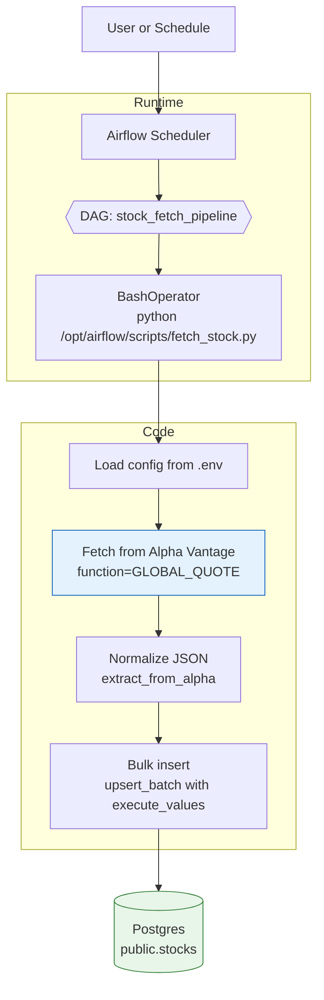
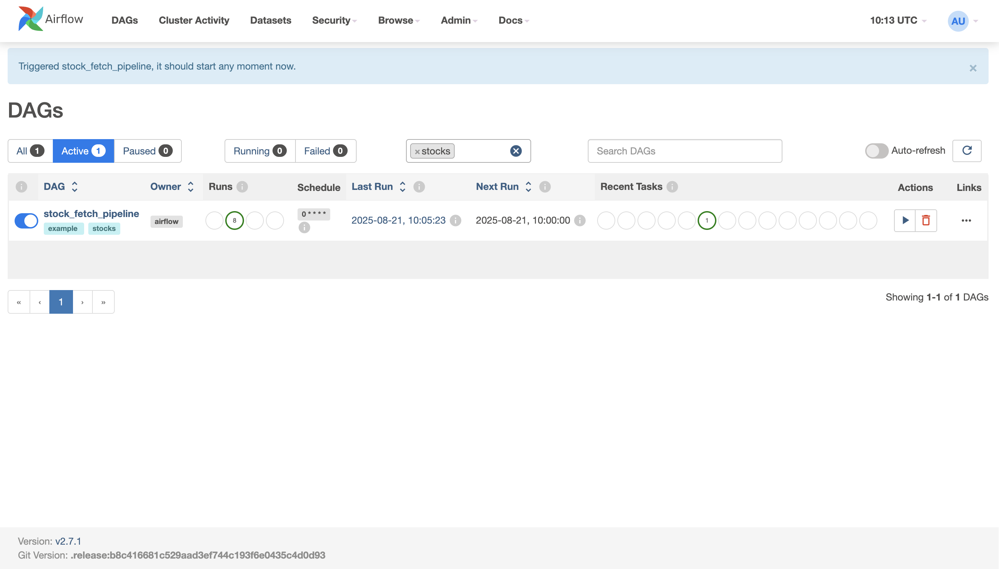
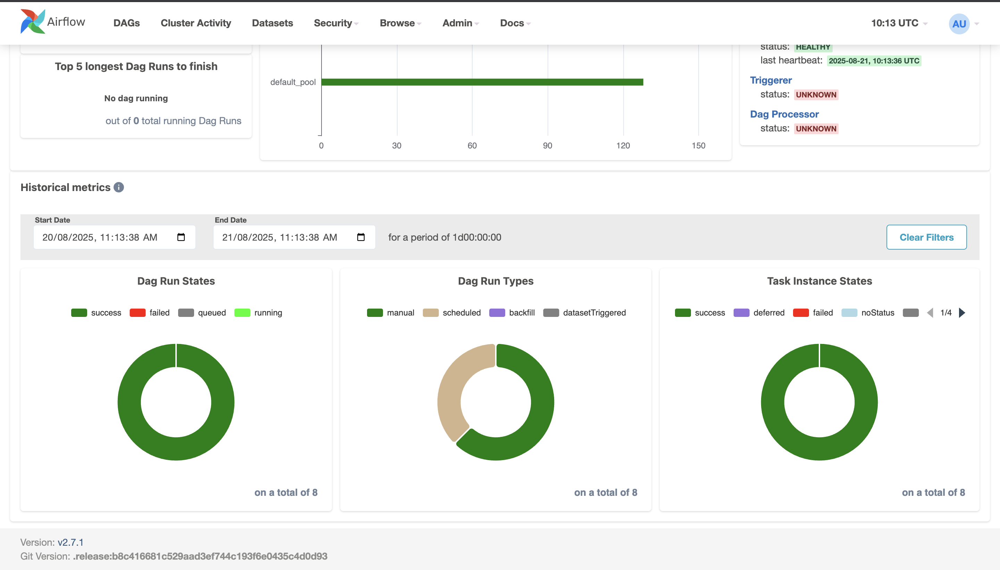

## Dockerized Stock Pipeline (Airflow)

### Overview
Dockerized data pipeline using Apache Airflow that fetches stock quotes from Alpha Vantage and stores them in PostgreSQL.

### Repository layout
- `docker-compose.yml`: Orchestrates Postgres and Airflow (webserver + scheduler + init).
- `Dockerfile`: Extends the official Airflow image with required Python packages.
- `dags/stock_dag.py`: Airflow DAG that runs the fetch job.
- `scripts/fetch_stock.py`: Python script that fetches quotes and writes to Postgres.
- `init-db/create_table.sql`: Creates `public.stocks` on Postgres init.
- `env.example`: Environment variable template.

### Prerequisites
- Docker and Docker Compose
- Alpha Vantage API key (free)

### Quick start
1) Copy environment template and set values
```bash
cp env.example .env
# Edit .env and set at least:
#   ALPHAVANTAGE_API_KEY=<your_key>
#   STOCK_SYMBOLS=MSFT,AAPL   # change as needed
```

2) Build and start services
```bash
docker compose build
docker compose up -d
```

3) Open Airflow and log in
- URL: http://localhost:8080
- Username: `admin`
- Password: `${AIRFLOW_ADMIN_PWD}` (default in `.env` is `admin`)

4) Enable and run the DAG
- In the Airflow UI, enable `stock_fetch_pipeline` and trigger a run, or run:
```bash
docker compose exec -T airflow-webserver airflow dags trigger stock_fetch_pipeline
```

5) Verify data in Postgres
```bash
docker compose exec -T postgres psql -U "$POSTGRES_USER" -d "$POSTGRES_DB" -c \
  "SELECT COUNT(*) AS rows, MAX(fetched_at) AS last_fetched FROM public.stocks;"
```

### Configure
Key environment variables (see `.env`):
- `ALPHAVANTAGE_API_KEY`: Required for Alpha Vantage API access.
- `STOCK_SYMBOLS`: Comma-separated tickers, e.g., `MSFT,AAPL`.
- `PIPELINE_SCHEDULE_CRON`: DAG schedule (default hourly: `0 * * * *`).
- `POSTGRES_HOST|PORT|DB|USER|PASSWORD`: DB connection.
- `STOCK_DB_SCHEMA|STOCK_DB_TABLE`: Target schema/table (default `public.stocks`).

Notes:
- When running everything via Docker Compose, keep `POSTGRES_HOST=postgres` (service DNS name).
- If you run the script locally (outside Docker), set `POSTGRES_HOST=localhost` (or the actual host).

### Development (local)
Use a virtualenv so editors can resolve imports:
```bash
python3 -m venv .venv
source .venv/bin/activate
pip install --upgrade pip
pip install -r <(printf "requests\npsycopg2-binary\n")
```

Editor configuration for basedpyright/pyright (`pyrightconfig.json` already included):
```json
{
  "venvPath": ".",
  "venv": ".venv",
  "reportMissingModuleSource": "warning"
}
```

Run the fetch script manually (inside Airflow container):
```bash
docker compose exec -T airflow-webserver python /opt/airflow/scripts/fetch_stock.py --symbols "MSFT,AAPL"
```

Run locally (outside Docker):
```bash
export $(grep -v '^#' .env | xargs)   # or set vars manually
python scripts/fetch_stock.py --symbols "MSFT,AAPL"
```

### Troubleshooting
- Webserver/scheduler complains: "You need to initialize the database"
  - Compose includes an `airflow-init` service that runs `airflow db init`. Recreate it:
    ```bash
    docker compose up -d --force-recreate airflow-init
    ```

- Editor shows "Import psycopg2.extras could not be resolved" (basedpyright)
  - Install packages in your `.venv` and select that interpreter in your editor.

- Alpha Vantage throttling
  - The script includes a 12s delay between API calls. For many symbols, expect runs to take longer.

- Database host confusion
  - Inside Docker Compose, use `POSTGRES_HOST=postgres`.
  - Outside Docker (local run), use `POSTGRES_HOST=localhost`.

### Data model
Table: `public.stocks`
- `symbol` TEXT
- `fetched_at` TIMESTAMPTZ
- `open`/`high`/`low`/`close` NUMERIC
- `volume` BIGINT
- `raw` JSONB (original provider payload)

### Architecture / Flow


### Security
- `.env` is ignored by git. Do not commit secrets.

### Screenshots




### License
See `LICENSE`.
